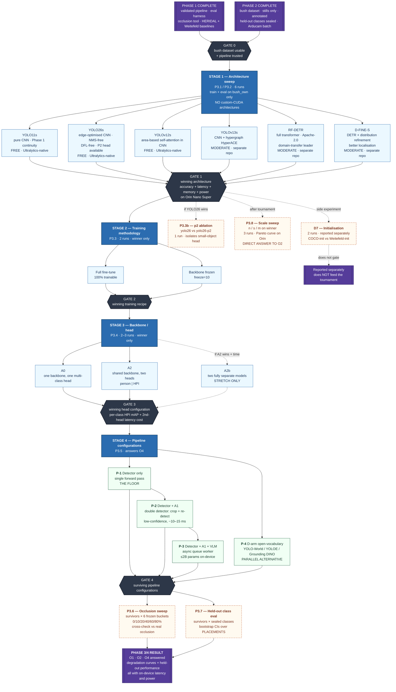

# Comparison Dependency Flowchart

Forest Runner SAR Drone, vision/AI track. Companion to
`PHASE_0_1_EXECUTION_GUIDE.md` (Phase 3 section) and `technical_work_timeline.md`.

Purpose: make explicit which comparisons gate which, so it's unambiguous what has to
finish before the next stage can start, and so the run count stays bounded.

**The core structural rule: this is an elimination tournament, not a grid.** Each
stage's winner is the only thing carried into the next stage. Running every
architecture through every head configuration through every pipeline configuration
would be 6 × 3 × 4 = 72 pipeline builds before the occlusion sweep multiplies it by
six again. The elimination structure keeps the whole of Phase 3 to roughly 30–40 runs.

---

## The graph

---

## Prerequisite table — what must finish before what

| Stage | Cannot start until | Produces | Blocks |
|---|---|---|---|
| **Gate 0** | Phase 1 pipeline validated; Phase 2 bush dataset annotated with held-out classes sealed | Trusted data + trusted plumbing | Everything |
| **Stage 1** — architecture sweep | Gate 0 | Winning architecture | Stages 2, 3, 4 |
| **P3.3b** — `yolo26-p2` ablation | Gate 1, and only if YOLO26 won | Small-object head verdict | **Nothing.** Reported alongside. |
| **P3.8** — scale sweep | Gate 1 | Accuracy/latency Pareto curve on the Orin | **Nothing.** Runs any time after the winner is known. |
| **Stage 2** — training methodology | Gate 1 | Winning training recipe | Stage 3 |
| **D7 side experiment** — initialisation | Gate 1 | COCO vs Weitefeld init comparison | **Nothing.** Reported separately, deliberately outside the tournament so it can't entangle the datasets. |
| **Stage 3** — backbone/head | Gate 2 | Winning head config (A0/A2/A2b) | Stage 4 |
| **Stage 4** — pipeline configs | Gate 3 | P-1…P-4 benchmarked | Stages 5a, 5b |
| **— P-2 (A1) specifically** | P-1 benchmarked | The bar the VLM must clear | **P-3.** Never start VLM work before A1 is benchmarked, or there's nothing fair to compare against. |
| **— P-3 (VLM)** | P-2 benchmarked; Jetson with NVMe swap configured | VLM throughput + backlog figures | Stage 5b |
| **— P-4 (D-arm)** | Gate 3 | Open-vocab performance | Stage 5b |
| **Stage 5a** — occlusion sweep | Gate 4; frozen buckets generated | Degradation curves | Final writeup |
| **Stage 5b** — held-out eval | Gate 4; seal verified programmatically | Headline result | Final writeup |

---

## Hard ordering constraints

Three orderings are non-negotiable. Everything else has slack.

**1. A1 before the VLM.** P-2 is the cheap alternative the VLM has to beat. Building
P-3 first and then retrofitting A1 as a comparison invites the accusation that the
baseline was tuned to lose. Benchmark A1, write the number down, then start VLM work.

**2. Architecture before head configuration.** A0 vs A2 is a question about class
imbalance, not about architecture. Running it across all four architectures would
triple the sweep for no extra insight, and would confound "does head separation help"
with "which backbone is better."

**3. Seal verification before held-out evaluation.** Assert programmatically that no
held-out class ID appears in any training manifest, and fail loudly. A leak
invalidates the single strongest result in the thesis, and it's precisely the failure
a config flag gets silently wrong.

---

## Decision points embedded in the graph

| Point | Rule | Consequence if it fails |
|---|---|---|
| **Custom-CUDA admission rule** | No architecture requiring hand-written CUDA kernels enters the sweep, for training or export | Applied pre-emptively: the SSM/Mamba arms were scrapped under this rule. All six current arms run on standard PyTorch ops and export to TensorRT through the ordinary path. |
| **A2b stretch** | Run only if A2 beats A0 on HPI classes by a meaningful margin **and** schedule remains after Phase 4 | Skip. If A2 didn't beat A0, doubling inference cost and memory almost certainly won't help, and "architectural separation wasn't necessary at this data scale" is the honest finding. |
| **A1 adoption** | Recovers meaningfully more recall than P-1 at acceptable precision cost, within latency budget | At ~10–15 ms the bar is low; if it fails, that itself is informative about crop resolution assumptions. |
| **VLM adoption** | Must beat **P-2** (not P-1) on held-out classes *and* low-confidence verification, with bounded queue backlog at realistic flight speed | Phase out the VLM. A documented negative result is a genuine contribution to edge-SAR system design. |
| **D-arm displaces VLM** | Matches VLM performance on held-out classes at one-forward-pass cost | Most likely outcome. Clean finding: open-vocab flexibility without generative cost. |

---

## What stays outside the tournament

Deliberately excluded from the elimination structure so they can't contaminate it:

- **HERIDAL and Weitefeld baselines** (Phase 1) — pipeline validation and their own
  occlusion sweeps. Never mixed into Phase 3 training. Every Phase 3 row carries
  `provenance_filter = bush_own`.
- **The D7 initialisation experiment** — sequencing Weitefeld pretraining into a bush
  fine-tune is legitimate and interesting, but it's reported as a standalone finding
  rather than becoming the silent default for every arm. That's what keeps D6's
  dataset separation legible.
- **The Arducam validation batch** — test-only, never trained on. It is the sole
  measurement of the DJI→Arducam domain gap now that FOV compensation has been dropped
  from collection.
- **LoRA** — considered and rejected for the closed-set detector (see P3.3). Remains in
  scope for Phase 4 VLM fine-tuning only, where it's the native and well-supported
  method.
- **SSM / Mamba detectors** — scrapped on time-constraint and deployment-risk grounds
  (see P3.1). They depend on hand-written `selective_scan` CUDA kernels that must
  compile on x86, compile again on ARM64, and then survive TensorRT export, any of
  which can fail outright rather than merely slowly. Vision Mamba, VMamba and
  MambaNeXt-YOLO remain in the literature review as the state-space lineage, with the
  exclusion stated as a scope decision rather than a judgement on their merits.

---

## Run budget

| Stage | Runs |
|---|---|
| Stage 1 — architecture sweep | 6 |
| Stage 2 — training methodology | 2 |
| D7 — initialisation side experiment | 2 |
| Stage 3 — backbone/head | 2 (3 with A2b) |
| Stage 4 — pipeline configurations | 4 |
| Stage 5a — occlusion sweep | survivors × 6 buckets |
| Stage 5b — held-out evaluation | survivors × 1 |
| P3.3b — `yolo26-p2` ablation | 1 (conditional) |
| P3.8 — scale sweep on winner | 3 |
| **Total** | **~30–40** |

Every row lands in `results/runs.csv`, one row **per class per run**, with git SHA,
dataset version, and device recorded. At this volume the schema being fixed before
run #1 is what makes the results section writable rather than an archaeology project.